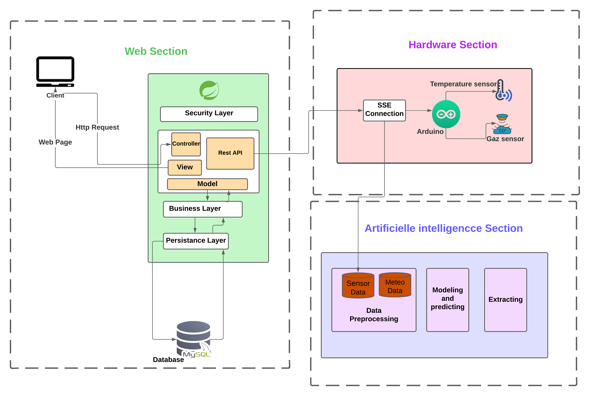

# Smart Building Energy Optimization Platform

<h4><center> Project members : Houda EL KORAINI - Rabab FAHSSI - Saad BAKANZIZE  </center></h4>
Welcome to our innovative Smart Building Energy Optimization Platform, a groundbreaking solution designed to revolutionize energy efficiency in the realm of smart buildings. This project is a fusion of cutting-edge technologies, leveraging the power of the Internet of Things (IoT) and Artificial Intelligence (AI) models to maximize energy optimization within built environments.

## Project Description
The software platform developed for this smart building energy optimization project leverages both the Internet of Things (IoT) and Artificial Intelligence (AI). It collects real-time data from various sensors deployed throughout the buildings via a robust IoT infrastructure. These data feed into AI predictive models that anticipate energy demand and identify inefficiencies, including energy leaks. The adaptability of AI enables dynamic adjustments to changes, ensuring continuous optimization. The platform provides a user-friendly interface for real-time monitoring, visualization of AI-generated recommendations, and manual adjustments. In summary, this software represents a significant advancement in intelligent energy management, fostering more efficient and sustainable smart buildings.

<details>
<summary>
<h2>Table of Contents</h2>
</summary>

- [Introduction](#Project Description)
- [Software architecture](#Software architecture)
- [Built With](#Built With)
- [Project Structure](#Project Structure)
- [Prerequisites](#Prerequisites)
- [How to Install and Run the Project](#How to Install and Run the Project)
- [Managing dependencies](#Managing dependencies)
- [Building for production](#Building for production)
- [Testing](#Testing)
- [Using Docker to simplify development](#Using Docker to simplify development)
</details>


## Software architecture
The architecture comprises three distinct sections: application, hardware, and artificial intelligence. In the application section, our energy optimization platform's software architecture utilizes Spring Boot for the backend and React.js for the frontend. Spring Boot controllers manage incoming requests, directing them to the service layer, which houses the application's business logic. This logic interacts with the MySQL database for data storage and retrieval, handling information from sensors. The React.js frontend organizes the user interface into components, promoting a modular and responsive design. React's state management ensures dynamic user experiences, with components making API calls to the Spring Boot backend for real-time data updates. Seamless interaction between the backend and frontend is achieved through RESTful APIs, ensuring efficient data processing and storage with MySQL and delivering an intuitive user interface.


## Built With

- [React.js](https://reactjs.org/) - A JavaScript library for building user interfaces
- [Spring Boot](https://spring.io/projects/spring-boot) - An extension of the Spring framework to simplify the development of Java applications
- [MySQL](https://www.mysql.com/) - An open-source relational database management system

## Project Structure

Node is required for generation and recommended for development. `package.json` is always generated for a better development experience with prettier, commit hooks, scripts and so on.

In the project root, JHipster generates configuration files for tools like git, prettier, eslint, husky, and others that are well known and you can find references in the web.

`/src/*` structure follows default Java structure.

- `npmw` - wrapper to use locally installed npm.
  JHipster installs Node and npm locally using the build tool by default. This wrapper makes sure npm is installed locally and uses it avoiding some differences different versions can cause. By using `./npmw` instead of the traditional `npm` you can configure a Node-less environment to develop or test your application.
- `/src/main/docker` - Docker configurations for the application and services that the application depends on


## Prerequisites

Before you begin, ensure that your development environment has the following software installed:

- **Node.js:** Make sure you have Node.js installed on your machine. You can download it from [https://nodejs.org/](https://nodejs.org/).

- **Java Development Kit (JDK):** The project uses Java for the backend. Ensure you have the Java Development Kit installed. You can download it from [https://www.oracle.com/java/technologies/javase-downloads.html](https://www.oracle.com/java/technologies/javase-downloads.html).

- **MySQL:** This project relies on a MySQL database. Ensure you have MySQL installed and running on your machine. You can download it from [https://www.mysql.com/](https://www.mysql.com/).

- **Git:** You'll need Git to clone the project repository. Download Git from [https://git-scm.com/](https://git-scm.com/).

- **npm (Node Package Manager):** npm is used for managing frontend dependencies. It comes with Node.js, so if you've installed Node.js, you should have npm as well.

- **Integrated Development Environment (IDE):** For Java development, we recommend using an IDE such as IntelliJ IDEA or Eclipse.


## How to Install and Run the Project

**Clone the Repository:**
   ```bash
   git clone https://gitlab.com/helko1/projetoptimisationenergitique
   cd projetoptimisationenergitique
  ```

**Database Configuration:**

Create a MySQL database and update the configuration in the application.properties file of the backend.

**Frontend Setup (React.js):**
```bash
   npm install
   npm start
  ```

**Backend Setup (Spring Boot):**
```bash
   ./mvnw 

  ```
**Access the Application:**

Open your web browser and go to http://localhost:3000.


### Managing dependencies

For example, to add [Leaflet][] library as a runtime dependency of your application, you would run following command:

```
npm install --save --save-exact leaflet
```

To benefit from TypeScript type definitions from [DefinitelyTyped][] repository in development, you would run following command:

```
npm install --save-dev --save-exact @types/leaflet
```

Then you would import the JS and CSS files specified in library's installation instructions so that [Webpack][] knows about them:
Note: There are still a few other things remaining to do for Leaflet that we won't detail here.

For further instructions on how to develop with JHipster, have a look at [Using JHipster in development][].

### JHipster Control Center

JHipster Control Center can help you manage and control your application(s). You can start a local control center server (accessible on http://localhost:7419) with:

```
docker-compose -f src/main/docker/jhipster-control-center.yml up
```

## Building for production

### Packaging as jar

To build the final jar and optimize the feOptimisationEnergie application for production, run:

```
./mvnw -Pprod clean verify
```

This will concatenate and minify the client CSS and JavaScript files. It will also modify `index.html` so it references these new files.
To ensure everything worked, run:

```
java -jar target/*.jar
```

Then navigate to [http://localhost:8080](http://localhost:8080) in your browser.

Refer to [Using JHipster in production][] for more details.

### Packaging as war

To package your application as a war in order to deploy it to an application server, run:

```
./mvnw -Pprod,war clean verify
```

## Testing

To launch your application's tests, run:

```
./mvnw verify
```

### Client tests

Unit tests are run by [Jest][]. They're located in [src/test/javascript/](src/test/javascript/) and can be run with:

```
npm test
```

For more information, refer to the [Running tests page][].

### Code quality

Sonar is used to analyse code quality. You can start a local Sonar server (accessible on http://localhost:9001) with:

```
docker-compose -f src/main/docker/sonar.yml up -d
```

Note: we have turned off authentication in [src/main/docker/sonar.yml](src/main/docker/sonar.yml) for out of the box experience while trying out SonarQube, for real use cases turn it back on.

You can run a Sonar analysis with using the [sonar-scanner](https://docs.sonarqube.org/display/SCAN/Analyzing+with+SonarQube+Scanner) or by using the maven plugin.

Then, run a Sonar analysis:

```
./mvnw -Pprod clean verify sonar:sonar
```

If you need to re-run the Sonar phase, please be sure to specify at least the `initialize` phase since Sonar properties are loaded from the sonar-project.properties file.

```
./mvnw initialize sonar:sonar
```

For more information, refer to the [Code quality page][].

## Using Docker to simplify development 

You can use Docker to improve your JHipster development experience. A number of docker-compose configuration are available in the [src/main/docker](src/main/docker) folder to launch required third party services.

For example, to start a mysql database in a docker container, run:

```
docker-compose -f src/main/docker/mysql.yml up -d
```

To stop it and remove the container, run:

```
docker-compose -f src/main/docker/mysql.yml down
```

You can also fully dockerize your application and all the services that it depends on.
To achieve this, first build a docker image of your app by running:

```
npm run java:docker
```

Or build a arm64 docker image when using an arm64 processor os like MacOS with M1 processor family running:

```
npm run java:docker:arm64
```

Then run:

```
docker-compose -f src/main/docker/app.yml up -d
```

When running Docker Desktop on MacOS Big Sur or later, consider enabling experimental `Use the new Virtualization framework` for better processing performance ([disk access performance is worse](https://github.com/docker/roadmap/issues/7)).

For more information refer to [Using Docker and Docker-Compose][], this page also contains information on the docker-compose sub-generator (`jhipster docker-compose`), which is able to generate docker configurations for one or several JHipster applications.


[jhipster homepage and latest documentation]: https://www.jhipster.tech
[jhipster 7.9.4 archive]: https://www.jhipster.tech/documentation-archive/v7.9.4
[using jhipster in development]: https://www.jhipster.tech/documentation-archive/v7.9.4/development/
[using docker and docker-compose]: https://www.jhipster.tech/documentation-archive/v7.9.4/docker-compose
[using jhipster in production]: https://www.jhipster.tech/documentation-archive/v7.9.4/production/
[running tests page]: https://www.jhipster.tech/documentation-archive/v7.9.4/running-tests/
[code quality page]: https://www.jhipster.tech/documentation-archive/v7.9.4/code-quality/
[setting up continuous integration]: https://www.jhipster.tech/documentation-archive/v7.9.4/setting-up-ci/
[node.js]: https://nodejs.org/
[npm]: https://www.npmjs.com/
[webpack]: https://webpack.github.io/
[browsersync]: https://www.browsersync.io/
[jest]: https://facebook.github.io/jest/
[leaflet]: https://leafletjs.com/
[definitelytyped]: https://definitelytyped.org/
